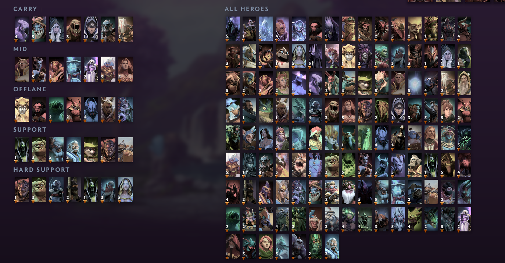
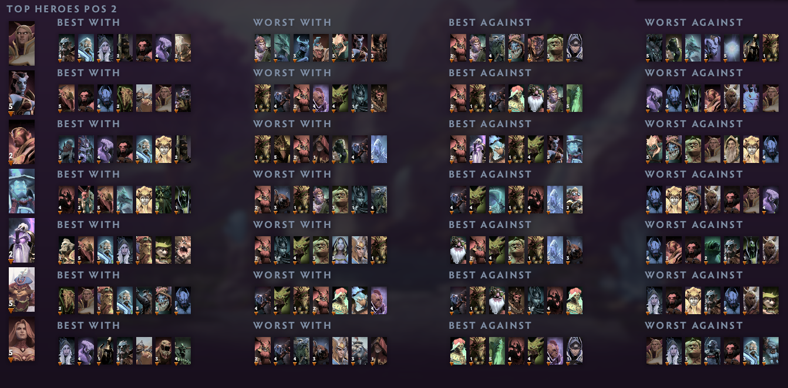
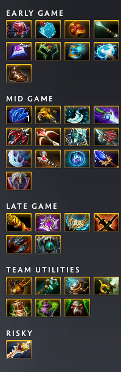

# Dota 2 Pro Tracker Hero Grids

[](https://github.com/ElRizeru/d2ptparsegrid/actions/workflows/update_grids.yml)
[](https://github.com/ElRizeru/d2ptparsegrid/actions/workflows/build_exe.yml)

Automated hero grid parser for [Dota 2 Pro Tracker](https://dota2protracker.com/meta-hero-grids). This project provides daily updated hero grids and a user-friendly installer to keep your Dota 2 client synchronized with the pro meta.

---

## 📸 In-Game Preview

### Hero Grids
Layouts organized by roles and current meta.

<p align="center">
  
</p>

---

### Counters & Synergies
Matchups and teammates based on D2PT data.

<p align="center">
  
</p>

---

### Item Builds
Item guides from OpenDotaGuides.

<p align="center">
  
</p>

---

## 🚀 Installation Options

### 1. Windows Executable (Recommended)
The easiest way for most users. No setup required.
1. Go to the [Releases](https://github.com/ElRizeru/d2ptparsegrid/releases/latest) page.
2. Download `D2PT-Grid-Updater.exe`.
3. Run it and follow the on-screen instructions.

### 2. PowerShell One-Liner (Zero Install)
Run the updater directly from the internet without downloading any files:
1. Open **PowerShell**.
2. Copy and paste the following command:
   ```powershell
   powershell -ExecutionPolicy ByPass -Command "irm https://raw.githubusercontent.com/ElRizeru/d2ptparsegrid/main/install.ps1 | iex"
   ```

### 3. Manual Python Execution
If you have Python installed and prefer running from source:
1. Download `main.py`.
2. Run: `python main.py`

---

## ✨ Features
- **Pro Meta Grids:** Automatically pulls data from D2PT for "Most Played", "High Winrate", and "D2PT Rating".
- **Item Builds:** Optional integration with high-quality item guides.
- **Auto-Discovery:** Automatically locates your Steam and Dota 2 installation folders.
- **Smart Backups:** Creates `.bak` files of your existing configurations before making changes.
- **Persistent Settings:** Remembers your choices (category, item guides) for one-click future updates.
- **Cross-Profile Support:** Updates grids for all Steam accounts found on your PC.

---

## 🛠️ Developer Setup

1. **Fork** this repository.
2. Enable **Read and Write permissions** in `Settings` -> `Actions` -> `General`.
3. The `Update Hero Grids` workflow runs daily at 00:00 UTC.
4. To build your own EXE, manually trigger the `Build and Release` workflow.

---

## 🙏 Acknowledgments
- **[Dota 2 Pro Tracker](https://dota2protracker.com/)** for providing the incredible meta data.
- **[OpenDotaGuides](https://github.com/Egezenn/OpenDotaGuides)** - Special thanks to @Egezenn for the automated item builds integration.
- **[Playwright](https://playwright.dev/)** for the scraping engine.

---

## 📄 License
This project is open-source and available under the MIT License.
